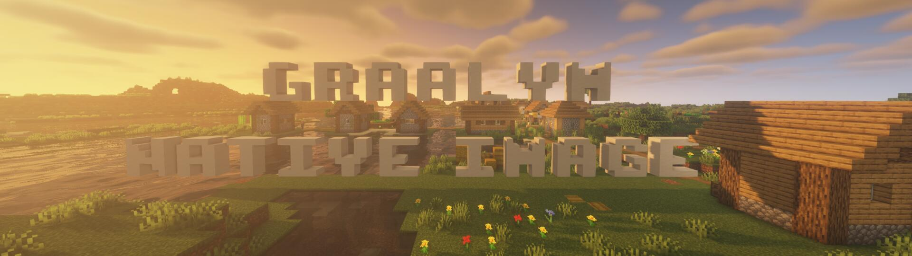

# Native Minecraft Servers with GraalVM Native Image

The Minecraft server is known to require a lot of CPU and memory resources and can be hard to deploy.
This project makes it possible to compile the Minecraft server into a self-contained native executable using [GraalVM Native Image][ni].
As such, it is supposed to require fewer CPU and memory resources, provide better startup times, and be easier and cheaper to deploy.

A native Minecraft server is less than 120MB in size, and with that significantly smaller than Minecraft's `server.jar` plus a JDK required to run it.
With [upx] compression, the size of the native executable can be reduced even further to less than 40MB, which is smaller than just the `server.jar`.
Initial experiments also suggest competitive run-time performance with a reduced memory footprint.
For best results, build with [GraalVM Enterprise][ee] Native Image, which provides better performance and lower memory usage than the Community Edition, and try out the [G1 GC][g1gc] and [Profile-Guided Optimizations][pgo].
The [Oracle Cloud Free Tier][oci-free] not only provides four Ampere A1 cores and 24 GB of RAM always free, which is plenty for [hosting a Minecraft server][oci-minecraft], but also free access to GraalVM Enterprise.

Check out [this blog post][blog-post] for more information.

*Disclaimer: This project is meant for demonstration purposes only and intended to help the Minecraft community evaluate the use of GraalVM Native Image. Please use at your own risk.*

## Getting Started

1. Download GraalVM [Community][ce] or [Enterprise][ee] *(GraalVM 22.2.0 or later is required)*.  
*Optional: make sure [upx] is on your `$PATH` to enable compression.*
2. Download or check out this repository and run the [`build.sh`](build.sh).
3. Launch the native Minecraft server with `./native-minecraft-server`.  
*The first time you run the server, you will have to follow the regular procedure of accepting Minecraft's EULA.*

## How It Works
This project only contains the `build.sh` script and [reachability metadata][metadata] for building a native Minecraft server.
The `build.sh` script first downloads Minecraft's `server.jar` and extracts jars and other resources from it.
Afterward, it invokes GraalVM Native Image with an appropriate configuration to generate a native version of the Minecraft server.
Finally, and only if [upx] is on the `$PATH`, the script will compress the native executable.

## Limitations and Known Issues

- The configuration currently only supports Minecraft `1.18.2`.
- The server GUI is not yet supported.
- Mods are currently not supported.
- There is no build script for Windows yet, but the [WSL] should work.
- The native executable sometimes fails on startup. Restarting it a few times usually helps.  
*Error: `com.mojang.datafixers.types.templates.List$ListType cannot be cast to java.lang.Comparable`*. 

## Contributions
Please [report any issues here on GitHub][issues] and open pull requests if you'd like to contribute to the project.

## License
This project is released under the [MIT license](./LICENSE).

[blog-post]: https://medium.com/p/1a3f6a92eb48
[ce]: https://github.com/graalvm/graalvm-ce-builds/releases/latest
[ee]: https://www.oracle.com/downloads/graalvm-downloads.html
[g1gc]: https://www.graalvm.org/22.2/reference-manual/native-image/optimizations-and-performance/MemoryManagement/
[issues]: https://github.com/hpi-swa/native-minecraft-server/issues
[metadata]: https://www.graalvm.org/22.2/reference-manual/native-image/metadata/
[ni]: https://www.graalvm.org/native-image/
[oci-free]: https://www.oracle.com/cloud/free/
[oci-minecraft]: https://blogs.oracle.com/developers/post/how-to-set-up-and-run-a-really-powerful-free-minecraft-server-in-the-cloud
[pgo]: https://www.graalvm.org/22.2/reference-manual/native-image/guides/optimize-native-executable-with-pgo/
[upx]: https://upx.github.io/
[wsl]: https://docs.microsoft.com/en-us/windows/wsl/install
